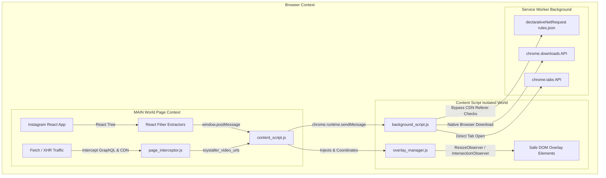
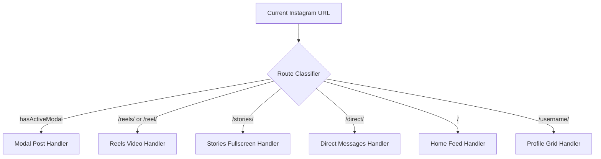

<div align="center">

# 🧸 Toystaller for Instagram (v6.0)

**High-Performance, Stealth Media Downloader & Media Viewer for Instagram**

[](https://developer.chrome.com/docs/extensions/mv3/intro/)
[](https://instagram.com)
[](https://github.com/SudiptaSanki/Toystaller)
[](LICENSE)

*A specialized, client-side Chromium extension that extracts original master HD videos and uncompressed photos from Instagram Reels, Stories, Profile Grids, Post Modals, and Direct Messages without external APIs or compression.*

---

### 📑 Quick Navigation
| [📖 Section 1: User Guide & Installation](#-section-1--user-guide--installation) | [📘 Section 2: Deep Technical Details & Architecture](#-section-2--deep-technical-details--architecture) | [🌐 Main Global Repo](https://github.com/SudiptaSanki/Toystaller) |
| :---: | :---: | :---: |

---

### 🌐 Official Repositories
* 🌟 **Main Global Multi-Platform Suite:** [https://github.com/SudiptaSanki/Toystaller](https://github.com/SudiptaSanki/Toystaller) *(Instagram, Facebook, LinkedIn, WhatsApp)*
* 📸 **Instagram Specialized Edition:** [https://github.com/SudiptaSanki/Toystaller-Instagram](https://github.com/SudiptaSanki/Toystaller-Instagram)

</div>

---

# 📖 SECTION 1: User Guide & Installation

## 🌟 Overview

**Toystaller for Instagram** is a next-generation browser extension engineered specifically for Instagram's modern single-page React application. Traditional downloaders rely on server-side scrapers that require you to paste links into ad-filled websites, or they scrape low-resolution `blob:` preview URLs from the DOM.

Toystaller operates **100% client-side** inside your browser. It directly accesses Instagram's internal React Fiber tree and network buffers to extract the original, full-resolution master MP4 videos and maximum-quality photos directly from Instagram's official CDN (`*.cdninstagram.com`).

---

## ✨ Features & Section Support

| Instagram Section | Supported Media | Extraction Capability | UI & Behavior |
| :--- | :--- | :--- | :--- |
| **Profile Grid (`/<username>/`)** | Images, Reels & Video Previews | Full-res photos, original video streams, high-res avatar | Hover over grid tiles for unobtrusive buttons; avatar supports direct download |
| **Post & Reel Modals (`[role="dialog"]`)** | Single Photos, Videos, Multi-slide Carousels | Maximum resolution candidates (`1080x1350`, `1440p`), master MP4s | **Zero-Bleed Isolation**: Instantly suppresses background grid overlays |
| **Reels Feed (`/reels/`, `/reel/<id>/`)** | Vertical Video Player | Progressive MP4 video stream + High-res poster image | Smart corner positioning in top/bottom-left avoiding Instagram like/sound controls |
| **Main Feed (`/`)** | Single Posts, Videos, Carousels | Highest width image from `srcset` or React Fiber master URL | Ignores story tray avatars and comment icons to keep feed clean |
| **Stories (`/stories/<username>/<id>/`)** | Video Stories & Photos | Active story media stream without overlays | Positioned safely below story progress indicator |
| **Direct Messages (`/direct/`)** | Shared Photos & Videos | Original quality media attachments | Compact button scaling; ignores chat participant avatars |

---

## 📥 Step-by-Step Installation Guide (New Users & Developers)

To install and run **Toystaller for Instagram** on any Chromium-based browser (Google Chrome, Brave, Microsoft Edge, Opera, Vivaldi, Arc):

### Prerequisites
- Any modern Chromium browser (Chrome 102+ recommended).
- Git installed (or simply download the project ZIP).

---

### Step 1: Clone or Download the Repository
Run the following command in your terminal:
```bash
git clone https://github.com/SudiptaSanki/Toystaller-Instagram.git
```
*Or click **Code ➔ Download ZIP** on GitHub and extract the folder to your computer.*

---

### Step 2: Open Browser Extensions Page
Open your browser and navigate to the extensions management page:
- **Google Chrome**: `chrome://extensions/`
- **Brave Browser**: `brave://extensions/`
- **Microsoft Edge**: `edge://extensions/`
- **Opera**: `opera://extensions/`

---

### Step 3: Enable Developer Mode
In the top-right corner of the Extensions page, toggle the switch labeled **Developer mode** to **ON**.

```
[ Developer mode ]  <--- (Toggle this to ON)
```

---

### Step 4: Load Unpacked Extension
1. Click the **Load unpacked** button in the top-left toolbar.
2. In the file dialog, select the cloned/extracted folder:
   ```
   Toystaller-Instagram/
   ```
   *(Make sure you select the folder containing `manifest.json`).*
3. Click **Select Folder** (or **Open**).

---

### Step 5: Pin and Verify
1. Click the **Puzzle icon** (Extensions menu) in your browser toolbar.
2. Locate **Toystaller for Instagram** and click the **Pin icon**.
3. Open [Instagram](https://www.instagram.com/) (or refresh any open Instagram tabs).
4. Hover over any post, reel, story, or profile picture — you will see the **Blue (Open Media)** and **Red (Open Poster)** overlay buttons!

---

## 🎮 How to Use

1. **Open / Save Full HD Video**:
   - Hover over any Reel or Video.
   - Click the **Blue Button** (Arrow Icon). The master MP4 link will open in a new tab for instant playback or saving (`Ctrl + S`).
2. **Open / Save High-Res Photo**:
   - Hover over any photo or profile avatar.
   - Click the **Blue Button** to open the uncompressed original image.
3. **Extract Poster / Video Thumbnail**:
   - Hover over any video.
   - Click the **Red Button** to extract the full-size video cover art.
4. **Settings Dashboard**:
   - Click the Toystaller icon in your browser toolbar to toggle the glassmorphism control panel.

---

## 📂 Project Structure

```text
Toystaller-Instagram/
├── manifest.json            # Extension manifest (MV3, permissions, content scripts)
├── background_script.js     # Background Service Worker for downloads & webRequest
├── content_script.js        # Content script orchestrator & button injection
├── overlay_manager.js       # Smart DOM positioning, collision & modal isolation
├── page_interceptor.js      # Main-world Fetch/XHR interceptor & React Fiber reader
├── rules.json               # DeclarativeNetRequest header spoofing rules
├── Toystaller_logo.png      # Extension branding & icons
├── platforms/
│   └── instagram.js         # Dedicated Instagram section detector & quality extractors
├── core/                    # Modular core architecture
│   ├── background_core.js
│   ├── content_core.js
│   ├── interceptor_core.js
│   └── overlay_manager.js
└── README.md                # Unified documentation & technical guide
```

---

<div align="center">
  <hr style="border: 2px solid #4facfe; margin: 40px 0;" />
</div>

# 📘 SECTION 2: Deep Technical Details & Architecture

> **Main Global Repository:** [https://github.com/SudiptaSanki/Toystaller](https://github.com/SudiptaSanki/Toystaller)

---

## 1. Why Standard Media Downloaders Fail on Instagram

Instagram's web architecture implements five layers of protection and optimization:

```
[User Browser]
   ├── 1. Blob URLs: <video src="blob:https://instagram.com/xyz...">
   │      └── Direct saving returns a corrupted or 0-byte file.
   ├── 2. DASH Segmentation: Video and audio are split into micro-chunks.
   ├── 3. Custom DOM Overlay Layers: Transparent divs layer over <video>,
   │      intercepting all right-click and context menu events.
   ├── 4. Referer Verification on CDN: Requests to *.cdninstagram.com lacking
   │      an official Referer header trigger HTTP 403 Forbidden.
   └── 5. Single-Page Navigation (SPA): Posts opened from profile grids render
          as modals without page reloads, leaving background media active.
```

Toystaller bypasses all five layers directly at the browser runtime level without modifying Instagram's original DOM or triggering anti-bot heuristics.

---

## 2. Full System Architecture



---

## 3. Detailed Component Breakdown

### 3.1 Main World Execution (`page_interceptor.js`)
Chrome extension content scripts run in an **Isolated World** by default. While this protects DOM integrity, it hides the page's actual JavaScript variables, React Fiber tree, and prototype chains (`window.fetch`, `window.XMLHttpRequest`).

Toystaller dynamically injects `platforms/instagram.js` and `page_interceptor.js` directly into the **MAIN world** at `document_start` using safe sequential script tags:

```javascript
const script = document.createElement('script');
script.src = chrome.runtime.getURL('page_interceptor.js');
(document.head || document.documentElement).appendChild(script);
script.remove();
```

---

### 3.2 React Fiber State Inspection Engine
Instagram's React components store their full data models (including direct CDN URLs, progressive MP4 streams, and multi-resolution image arrays) inside internal DOM node properties prefixed with `__reactFiber$` or `__reactProps$`.

When a user hovers or clicks a media item:
1. The extension queries the target `<video>` or `` DOM node.
2. Traverses parent ancestors up to 12 levels in the DOM tree looking for Fiber instances.
3. Recursively scans the Fiber state tree for candidate fields:
   - `video_versions`: Array of streams ordered by bitrate and resolution (`height: 1080`, `height: 720`).
   - `image_versions2.candidates`: Array of image objects ordered by resolution (`width: 1440`, `width: 1080`).
   - `display_url` / `display_resources`: Direct uncompressed CDN links.
   - `progressiveUrl` / `streamingUrl`: High-bandwidth master MP4 streams.

---

### 3.3 Dynamic Network Interception Pipeline
In addition to React Fiber inspection, `page_interceptor.js` monkey-patches `window.fetch` and `window.XMLHttpRequest` at runtime:
- Watches for responses from `/graphql/query/`, `instagram.com/api/v1/`, and `*.cdninstagram.com`.
- Clones responses asynchronously without blocking page performance.
- Parses JSON payloads in real time, harvesting valid video and image CDN URLs into an indexed memory set.
- Automatically rejects thumbnail covers, DASH manifests (`.mpd`), and segmented chunks (`bytestart/byteend`) using an intelligent scoring algorithm:
  $$\text{Score} = +10(\text{.mp4}) + 20(\text{1080p}) + 10(\text{720p}) - 50(\text{dash}) - 500(\text{thumbnail})$$

---

### 3.4 Overlay Manager & Collision Resolution Engine (`overlay_manager.js`)
Rather than altering Instagram's fragile layout by appending child elements inside `<video>` wrappers, `OverlayManager` appends all UI elements to `document.body` with `position: fixed` and `z-index: 2147483646`.

Key features:
- **`ResizeObserver`**: Instantly tracks changes in media dimensions and viewport scaling.
- **`IntersectionObserver`**: Deactivates overlays for off-screen media (threshold: 15%).
- **Collision Avoidance (`cornerHasConflict`)**: Detects native Instagram interactive controls (Mute, Volume, Close, Share, Like) and automatically shifts buttons to alternative corners (`top-left` ➔ `bottom-left` ➔ `top-right`).

---

### 3.5 Modal Isolation & Zero-Bleed Backdrop Engine
On Instagram user profile pages (`https://www.instagram.com/<username>/`), clicking any grid item creates a `<div role="dialog">` modal over the existing 20+ grid items.

**The Zero-Bleed Algorithm:**
1. A real-time `MutationObserver` on `document.body` monitors modal creation/removal.
2. When a modal opens (`hasActiveModal() === true`), all background overlays outside the modal are immediately forced to `display: none; visibility: hidden; pointer-events: none;`.
3. Pointer hit testing (`document.elementsFromPoint`) verifies that cursor coordinates directly intersect with the active modal media before allowing any overlay to display.

---

### 3.6 DeclarativeNetRequest & Referer Header Spoofing (`rules.json`)
When opening direct CDN links (`https://scontent.cdninstagram.com/...`) in a new browser tab, Instagram returns HTTP 403 Forbidden because the request lacks an internal Instagram Referer header.

Toystaller includes a declarative net request ruleset in `rules.json`:
```json
[
  {
    "id": 1,
    "priority": 1,
    "action": {
      "type": "modifyHeaders",
      "requestHeaders": [
        {
          "header": "Referer",
          "operation": "set",
          "value": "https://www.instagram.com/"
        }
      ]
    },
    "condition": {
      "urlFilter": "||cdninstagram.com",
      "resourceTypes": ["main_frame", "sub_frame", "media", "xmlhttprequest"]
    }
  }
]
```
This ensures uninhibited playback and clean direct file downloads in any browser tab.

---

## 4. Instagram Section-by-Section Handler Matrix



| Section | Detection Rule | Target Strategy | Filter Strategy |
| :--- | :--- | :--- | :--- |
| **Modal Dialog** | `[role="dialog"], [aria-modal="true"]` | Topmost post media, carousel visible slide | Rejects all background grid items, comment avatars, suggested accounts |
| **Profile Grid** | `/<username>/`, `/<username>/saved/` | Grid post tiles (`scale: 0.75`), header avatar (`scale: 0.8`) | Rejects story highlight circles (`[role="menu"]`), icons `< 80px` |
| **Reels** | `/reels/`, `/reel/<id>/` | Viewport-centered active vertical reel | Rejects side preview thumbnails, comment icons |
| **Feed** | `/` (Home) | Main post `<article>` media | Rejects top story tray circles, author avatars |
| **Stories** | `/stories/<username>/<id>/` | Screen-centered active story | Rejects blurred left/right story preview cards |
| **Direct Messages** | `/direct/` | Chat media attachments (`> 150px`) | Rejects contact avatars in sidebar list |

---

## 5. Comparison with Alternative Approaches

| Feature / Metric | Toystaller for Instagram | Generic Web Scraper / Web Tools | DOM Video Scraping Extensions |
| :--- | :--- | :--- | :--- |
| **Video Quality** | **1080p / Original Master MP4** | Often capped at 720p | Capped at compressed preview |
| **Image Resolution** | **Uncompressed (up to 1440p)** | Compressed JPEG | Screen-size cropped preview |
| **Account Safety** | **100% Safe (Local client-side)** | High risk (Requires login/cookies) | Safe |
| **Speed** | **Instant (0 ms network overhead)** | Slow (Server processing time) | Instant |
| **Advertisements / Trackers** | **None (Zero)** | Heavy Adware / Popups | Minimal |
| **Private Account Support** | **Yes (If you follow the account)** | No | Limited |

---

## 6. Global Multi-Platform Ecosystem

Toystaller was engineered as a modular framework. While this repository represents the **specialized standalone edition for Instagram**, the **Main Global Repository** provides multi-platform capabilities across the entire social web:

- 📷 **Instagram**: Reels, Stories, High-Res Posts, Profile Avatars, DMs.
- 💼 **LinkedIn**: Uncompressed Document Images, Native Video Streams.
- 📘 **Facebook**: Mobile & Desktop Progressive Video Extraction, High-Res Photos.
- 💬 **WhatsApp Web**: Full-Resolution Media Attachments & Voice Notes.

👉 **Explore the Main Project:** [https://github.com/SudiptaSanki/Toystaller](https://github.com/SudiptaSanki/Toystaller)

---

<div align="center">

### 🛡️ Privacy & Security Guarantees
**100% Client-Side** • **No External Trackers** • **Direct Official CDN Streams**

---

Made with ❤️ by <a href="https://github.com/SudiptaSanki">Sudipta Sanki</a>

</div>
